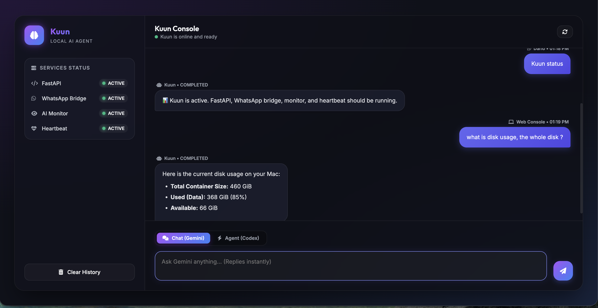
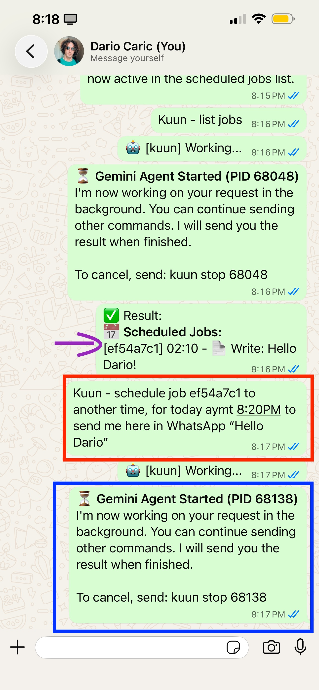
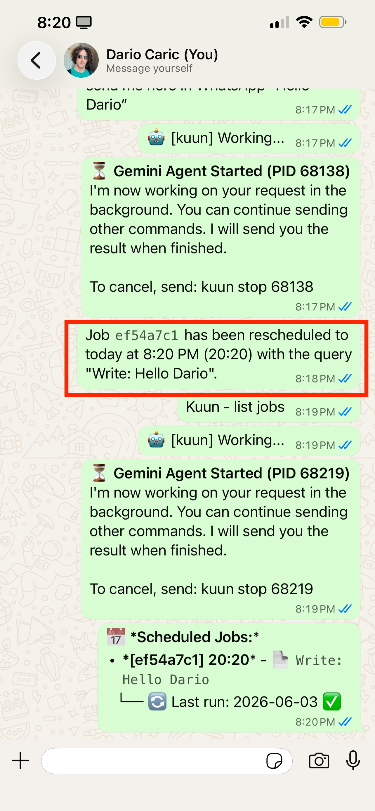
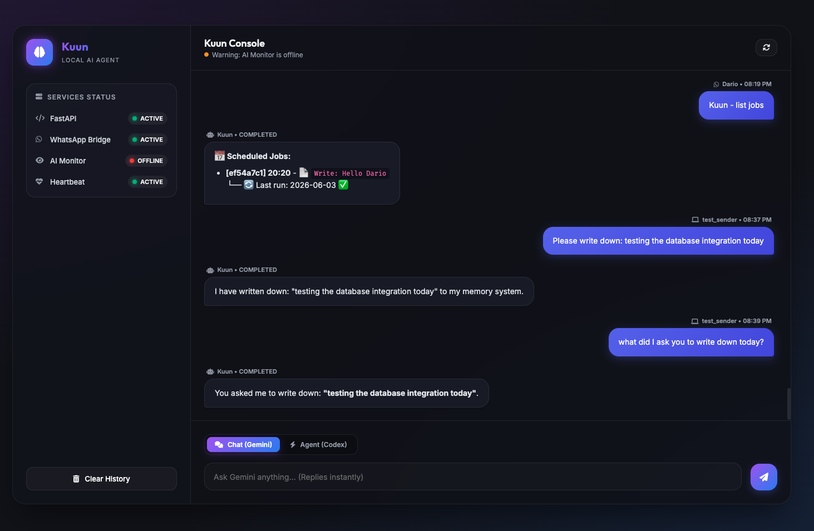
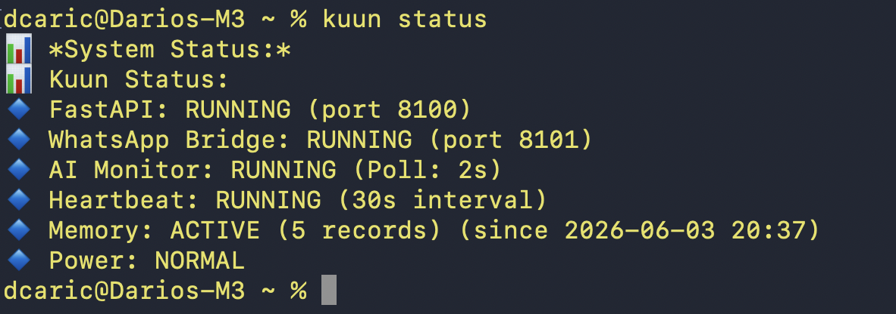

# Kuun

Kuun is a powerful, cost-effective, WhatsApp-controlled AI agent that can run 24/7 on a local home machine or be deployed on a server.

- **Runs locally or on a server**: keep Kuun on your home Mac/Linux machine, a mini-PC, or a VPS.
- **Cost-effective AI automation**: leverages API/CLI agents instead of requiring a large always-on model.
- **Gemini + Codex background agents**: sends long-running Gemini and Codex tasks into background threads and replies when results are ready.
- **Extensible agent providers**: built around Gemini and Codex today, with room to add other CLI agents such as Claude.
- **WhatsApp command bridge**: accepts trusted commands from WhatsApp through local bridge services.
- **Heartbeat + scheduler**: keeps the agent loop alive and supports recurring scheduled jobs.
- **Self-building script skills**: when Kuun discovers a reusable task pattern, it can create helper scripts in `scripts/` and record them in `SCRIPTS.md` so the skill can be reused later.
- **Small and understandable core**: keeps the bridge-and-agent workflow lightweight while avoiding risky shell-command shortcuts by default.

## What Kuun Does

- **WhatsApp bridge**: links WhatsApp to a local FastAPI task server through Baileys.
- **Gemini API jobs**: uses `GOOGLE_API_KEY` and `GEMINI_MODEL` for background Gemini tasks.
- **Codex jobs**: uses Codex CLI for background repo/coding tasks.
- **Safe reply modes**: trusted/public conversational replies are restricted and do not run tools.
- **Allowlists**: admin numbers can trigger agent tasks; trusted contacts/groups can receive conversational replies.
- **Scheduler**: recurring WhatsApp-defined jobs can run Gemini checks at a daily time.
- **Self-building script index**: reusable helper scripts can be saved under `scripts/` and documented in `SCRIPTS.md`.

## Web UI Console

Kuun includes a modern, glassmorphic local Web UI console that allows you to chat and interact with the agent directly in your browser.



### How to Access the Web UI
1. Ensure your Kuun services are running (`kuun start` or `kuun restart`).
2. Open your web browser and navigate to:
   ```
   http://localhost:8100/chat
   ```

### Web UI Features
* **Chat (Gemini) Mode**: Send direct messages to Gemini with instant response times. Gemini runs locally using the `agy` CLI with tool calling and command execution enabled, allowing it to retrieve system metrics (like disk space) on demand.
* **Agent (Codex) Mode**: Queue asynchronous coding and repository automation tasks that run in the background. Live execution and progress logs are streamed directly below the message bubbles.
* **Custom Confirmation Modals**: Elegant dark-mode modal boxes for clearing chat history safely without focus disruption.
* **Real-time Status Panel**: Visual indicator of FastAPI, WhatsApp Bridge, AI Monitor, and Heartbeat service health.

## Requirements

- macOS or Linux
- Node.js and npm
- Python 3 with `venv`
- A Gemini API key
- Codex CLI login if you want Codex background tasks

Kuun prefers the Codex Desktop bundled CLI at:

```bash
/Applications/Codex.app/Contents/Resources/codex
```

If that is not available, it falls back to `/opt/homebrew/bin/codex` or `codex` from `PATH`.

## Installation

### 1) Clone Kuun

```bash
git clone https://github.com/dcaric/Kuun.git ~/Kuun
cd ~/Kuun
```

### 2) Run The Installer

Recommended full installer:

```bash
./install.sh
```

If the repo is already cloned and you only want to install dependencies:

```bash
./kuun setup
```

`kuun setup` creates/uses `venv`, installs Python dependencies from `requirements.txt`, and installs Node dependencies with `npm install`.

### 3) Configure Required Values

Kuun reads `kuun.config`. If it does not exist, it is copied from `kuun.config.example`.

Important keys:

```env
BOT_TRIGGER=kuun
GOOGLE_API_KEY=your_gemini_api_key
GEMINI_MODEL=gemini-3.1-flash-lite
AI_PROVIDER=gemini
CODEX_MODEL=gpt-5.4
ALLOWED_NUMBERS=38591...,38598...
BRIDGE_SECRET_KEY=auto_generated_or_custom_secret
FASTAPI_PORT=8100
WA_API_PORT=8101
SYSTEM_AWAKE=false
```

Useful setup commands:

```bash
kuun geminikey <your_google_api_key>
kuun gemini gemini-3.1-flash-lite
kuun add-number <your_whatsapp_number>
kuun name kuun
```

### 4) Link WhatsApp

Run WhatsApp linking in the foreground:

```bash
kuun whatsapp link
```

`kuun whatsapp link` resets the local WhatsApp auth cache and forces a fresh QR code. Scan the QR code in WhatsApp under **Linked devices**.

### 5) Start Services

```bash
kuun start
```

### 6) Check Status

```bash
kuun status
```

### 7) Test From WhatsApp

Send these from an allowed WhatsApp number:

```text
kuun - what time is it in Zagreb?
kuun c check Kuun status
```

### 8) Watch Logs

```bash
tail -f ~/Kuun/kuun.log
```

If installed somewhere else, use the log path printed by `kuun -h`.

## CLI Commands

### Service Lifecycle

| Command | Example | What it does |
| --- | --- | --- |
| `kuun setup` | `kuun setup` | Installs Python and Node dependencies. |
| `kuun update` | `kuun update` | Pulls latest git changes and refreshes dependencies. |
| `kuun start` | `kuun start` | Starts FastAPI, WhatsApp bridge, monitor, and heartbeat in the background. |
| `kuun stop` | `kuun stop` | Stops Kuun services gracefully where possible. |
| `kuun kill` | `kuun kill` | Force-kills Kuun-related processes, including the awake helper. |
| `kuun restart` | `kuun restart` | Runs `stop`, waits briefly, then runs `start`. |
| `kuun status` | `kuun status` | Shows service status for FastAPI, WhatsApp bridge, monitor, heartbeat, and power mode. |
| `kuun gitpull` | `kuun gitpull` | Alias for `kuun update`. |
| `kuun help` or `kuun -h` | `kuun -h` | Shows command help. |

### Model And Account Configuration

| Command | Example | What it does |
| --- | --- | --- |
| `kuun name <name>` | `kuun name luna` | Sets `BOT_TRIGGER`, the WhatsApp trigger word. |
| `kuun geminikey <key>` | `kuun geminikey AIza...` | Saves `GOOGLE_API_KEY` into `kuun.config`. |
| `kuun gemini <model>` | `kuun gemini gemini-3.1-flash-lite` | Sets `GEMINI_MODEL` and switches `AI_PROVIDER` to `gemini`. |
| `kuun tokens <in> <out>` | `kuun tokens 0.10 0.40` | Saves Gemini input/output price metadata as `GEMINI_PRICE_IN` and `GEMINI_PRICE_OUT`. |
| `kuun gmail <user> <pass>` | `kuun gmail you@gmail.com "aaaa aaaa aaaa aaaa"` | Saves `GMAIL_USER` and `GMAIL_APP_PASSWORD` into `kuun.config`. |

### Admin Numbers

Admin numbers are the only WhatsApp senders allowed to trigger background agent tasks.

| Command | Example | What it does |
| --- | --- | --- |
| `kuun add-number <num>` | `kuun add-number 385911234567` | Adds a phone number to `ALLOWED_NUMBERS`. |
| `kuun remove-number <num>` | `kuun remove-number 385911234567` | Removes a phone number from `ALLOWED_NUMBERS`. |
| `kuun users` | `kuun users` | Lists allowed admin numbers. |
| `kuun list-numbers` | `kuun list-numbers` | Alias for `kuun users`. |

Use international format without spaces when possible, for example:

```bash
kuun add-number 385911234567
```

### Trusted Contacts And Groups

These CLI commands print the WhatsApp command to use. Actual whitelist changes are handled by the running WhatsApp agent, because it can resolve contacts from WhatsApp metadata.

| Command | Example | What it does |
| --- | --- | --- |
| `kuun whitelist <name> [pushname]` | `kuun whitelist Ana` | Shows the WhatsApp command for adding a trusted contact. |
| `kuun whitelist add <name>` | `kuun whitelist add Ana` | Legacy compatibility form for trusted contacts. |
| `kuun whitelist remove <name>` | `kuun whitelist remove Ana` | Shows the WhatsApp command for removing a trusted contact. |
| `kuun whitelist` | `kuun whitelist` | Shows the WhatsApp command for listing trusted contacts. |
| `kuun whitelist group add <id-or-name>` | `kuun whitelist group add Family` | Shows the WhatsApp command for allowing replies in a group. |
| `kuun whitelist group remove <id-or-name>` | `kuun whitelist group remove Family` | Shows the WhatsApp command for removing a group. |
| `kuun whitelist group` | `kuun whitelist group` | Shows the WhatsApp command for listing allowed groups. |

### WhatsApp Bridge

| Command | Example | What it does |
| --- | --- | --- |
| `kuun whatsapp` | `kuun whatsapp` | Runs the WhatsApp bridge in the foreground. |
| `kuun whatsapp link` | `kuun whatsapp link` | Resets local WhatsApp auth cache, runs the bridge in foreground, and displays a fresh QR code. |

### Power Mode

| Command | Example | What it does |
| --- | --- | --- |
| `kuun awake` | `kuun awake` | Sets `SYSTEM_AWAKE=true` and starts `caffeinate` on macOS. |
| `kuun awakestop` | `kuun awakestop` | Sets `SYSTEM_AWAKE=false` and stops the awake helper. |

## Remote WhatsApp Commands

Replace `kuun` with your configured `BOT_TRIGGER` if you changed it with `kuun name <name>`.

### Gemini Background Jobs

```text
kuun - <question>
kuun g <question>
```

Examples:

```text
kuun - what time is it in Zagreb?
kuun g summarize the latest notes I sent you
```

Kuun sends a “working” message, runs Gemini in the background, and replies when the output file is ready.

### Codex Background Jobs

```text
kuun c <task>
kuun codex <task>
```

Examples:

```text
kuun c inspect this repo and tell me what commands are available
kuun codex check whether README and CLI help are consistent
```

Codex runs in the Kuun repository using `CODEX_MODEL` and sends back the final result.

### Scheduler

```text
kuun set job which will at <HH:MM> check <query>
kuun set job which will at <H>h check <query>
kuun list all scheduled jobs
kuun list jobs
kuun remove the scheduled job with ID <id>
kuun remove job <id>
```

Examples:

```text
kuun set job which will at 13h check weather in Split
kuun list jobs
kuun remove job abc12345
```

Scheduled jobs are stored in `brain/scheduled_jobs.json` and run once per day at the configured time.

#### Scheduling via WhatsApp
When scheduling and managing jobs via WhatsApp, the conversation flows natively:

| Rescheduling a Job | Active Jobs List |
| --- | --- |
|  |  |

#### Scheduling via Web UI
The local Web UI console supports the exact same scheduling and task management features but provides a dedicated desktop console layout:



What you do via WhatsApp and the Web UI is fully synchronized in real-time, utilizing the same background execution queues and local database state.

### Status And Restart

```text
kuun status
kuun restart
kuun help
```

### Trusted Contacts

```text
kuun whitelist <name> [pushname]
kuun whitelist add <name>
kuun whitelist remove <name>
kuun whitelist
```

Trusted contacts can receive conversational replies without triggering full background agent tasks.

### Trusted Groups

```text
kuun whitelist group add <id-or-name>
kuun whitelist group remove <id-or-name>
kuun whitelist group
```

Groups are ignored by default unless a message directly replies to the bot or the group is explicitly allowlisted.

## Security Model

- Empty `ALLOWED_NUMBERS` means no one can trigger agent tasks.
- Full agent/background jobs require an admin number or `fromMe` authorization.
- Conversational replies for trusted contacts use restricted `public_chat` or `trusted_chat` behavior.
- `BRIDGE_SECRET_KEY` protects local FastAPI and WhatsApp send endpoints.
- Kuun intentionally does **not** expose a remote shell shortcut such as `run command - <cmd>`.
- Keep `kuun.config` private. It can contain API keys, app passwords, and phone numbers.

## Long-Term Memory (RAG)

Kuun includes a robust, local long-term memory system modeled after Satele's persistent log storage. All user queries, CLI runs, and assistant responses are automatically indexed chronologically in a local JSON Lines format database (`brain/kuun_memory/memory_log.jsonl`). 

This allows Kuun to recall past conversations and retrieve relevant history for Retrieval-Augmented Generation (RAG) on demand, enabling you to ask questions like *"what did we do yesterday?"* or *"what did I ask you to write down earlier?"*.

### Memory Status
You can check the health of the memory database, total record count, and the earliest memory timestamp directly via the `kuun status` CLI command:



## What Kuun Does Not Include

Kuun intentionally keeps the scope small. It does not include WhatsApp chat search, outbound-only contact management, local Ollama model management, IDE/global skill installation, or passwordless sudo setup.
